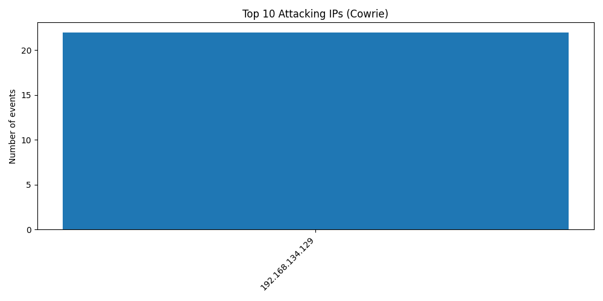
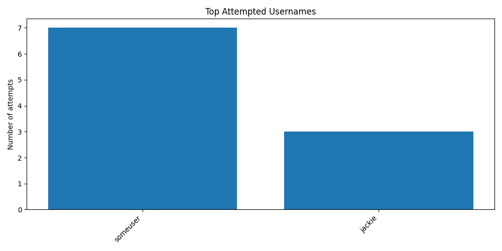
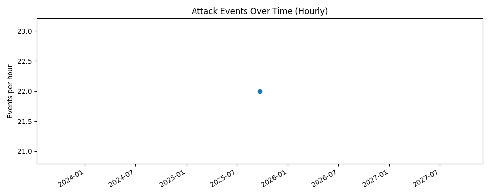

# 🕵️ Honeypot Project – Tracking Attackers with Cowrie

## 📖 Overview
This project is a cybersecurity lab exercise where I deployed a **honeypot** using [Cowrie](https://github.com/cowrie/cowrie).  
A honeypot is a **decoy system** designed to attract attackers and log their activity.  
In this case, Cowrie simulates a vulnerable SSH/Telnet server, records login attempts, and stores the commands executed by attackers.  

I extended Cowrie with **Python log analysis scripts** that parse the data and generate **visualizations** showing who is attacking, what usernames they try, and when the attacks occur.

This project demonstrates:
- Threat monitoring
- Incident data collection
- Security analytics with Python
- Hands-on learning in a controlled lab environment

---

## ✨ Features
- Deployed **Cowrie honeypot** on Kali Linux VM  
- Captures:
  - Source IP addresses of attackers
  - Usernames and passwords used in brute force attempts
  - Commands executed inside the honeypot
- JSON logs parsed into CSV with `jq`
- Python scripts generate:
  - **Top Attacking IPs** (`top_ips.png`)
  - **Top Usernames Attempted** (`top_usernames.png`)
  - **Attack Timeline** (`timeline.png`)

---

## 🚀 Setup Guide

### 1. Clone and Install Cowrie
```bash
git clone https://github.com/cowrie/cowrie.git
cd cowrie
python3 -m venv cowrie-env
source cowrie-env/bin/activate
pip install --upgrade pip
pip install -r requirements.txt
```

### 2. Run the Honeypot
```bash
./bin/cowrie start
```

Logs are saved in: 
```bash
var/log/cowrie/cowrie.json
```

### 3. Parse Logs into CSV

```bash
cat var/log/cowrie/cowrie.json \
  | jq -r '[ .timestamp, .src_ip, .username // "", .event, (.message // "") ] | @csv' \
  > cowrie_parsed.csv
```

### 4. Visualize Data with Python

```bash
python3 plot_top_ips.py
python3 plot_top_usernames.py
python3 plot_timeline.py
```

---

## 📊 Example Outputs

### Top Attacking IPs


### Top Usernames Attempted


### Attack Timeline



---


### 💡 Insights Gained

Majority of brute-force attempts target root or admin accounts.

Attacks come from a wide range of automated botnets.

Simple honeypots can reveal attacker strategies without exposing real systems.

---

### 🛡️ Disclaimer

This honeypot was deployed in an isolated lab environment only.
Never expose Cowrie directly to the public internet without proper safeguards.

---

### 📎 Resources

[Cowrie Documentation](https://cowrie.readthedocs.io/en/latest/)

[jq JSON Processor](https://stedolan.github.io/jq/)

[Matplotlib](https://matplotlib.org/)

## Blog post

[Blog link](https://medium.com/@mugehajacky/hackers-tried-to-break-into-my-fake-server-heres-what-i-learned-989bc3cde541)
